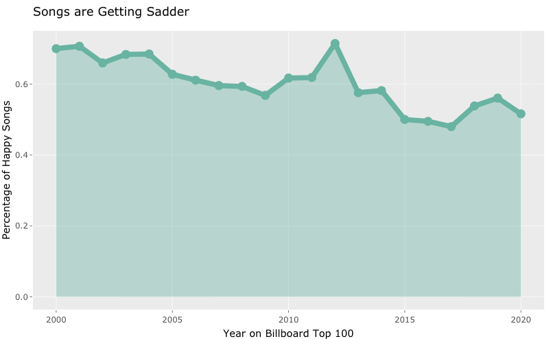

```{r setup, include=FALSE}
knitr::opts_chunk$set(echo = TRUE)
knitr::opts_chunk$set(echo = TRUE, message=FALSE, warning=FALSE)
library(tidyverse)
library(knitr)
library(lubridate)
library(tidymodels)
library(spotifyr)

```
The purpose of our project was to create a model that could analyze whether a song should be classified as “happy” or “sad”, and then use that model to analyze how the general sentiment of popular music in the United States has trended over the past 20 years. With [depressions](https://www.federalreservehistory.org/essays/great-recession-of-200709), [pandemics](https://www.nytimes.com/article/coronavirus-timeline.html), record [economic expansions] (https://money.usnews.com/investing/stock-market-news/articles/2019-11-29/decade-in-review-2010s-was-the-decade-of-the-bull) and [tremendous social change] (https://www.seattletimes.com/life/a-look-back-at-10-of-the-biggest-social-movements-of-the-2010s-and-how-they-shaped-seattle/), the United States has experienced some of the most unique events in its economic and social history over the past 20 years. Throughout this period, we want to investigate whether songs have become happier, sadder, or trended up and down along with the events playing out on the national stage. 

In order to do so, we began by collecting a dataset of happy and a dataset of sad songs across different genres in order to train our random forest classification model. We created these datasets by pulling user-created playlists from the Spotify API that contained either happy or sad songs. It is important to note that these songs were not objectively “happy” or “sad”, but instead reflected Spotify users’ preferences for what they found to be “happy” or “sad”. In choosing to select songs in this format and by aggregating 28 playlists together for a total of ~2,000 songs, we were able to create a dataset that reflected a more general definition of a “sad” song that reflected our biases as little as possible. In addition, diversity of genre was important in order to create a model that was robust to changes in the popularity of genres over different time periods. For example, hip hop music is the dominant genre nowadays, but in the early 2000s the charts were dominated by pop punk songs. From our dataset, we selected four features on which to train the model: tempo, valence, danceability, and mode (key). Training the random forest classification model off these songs, we achieved a test accuracy rate of 75%.

After building the random forest model, we wanted to use it to analyze how sentiment of popular songs has trended over the past 20 years. We used the billboard hot 100 charts of each year since 2000 as a proxy for popular songs in that year. We compiled that data by pulling billboard hot 100 playlists of each year from Spotify and fed them into the model, yielding the following result:



As you can see, there is a clear trend of songs getting sadder over the past 20 years. This might be related to the [rising depression rates](https://www.sciencedirect.com/science/article/pii/S0165032711007993) that we have witnessed over the same time period as social media has become more prevalent. Interestingly, we see the strongest rebound in sentiment during the recovery from the great recession. This might reflect the general positive notion at the time after coming from such a difficult period of economic hardship.

This study could have been significantly improved had we had access to lyrics data in order to run a sentiment analysis of our traning dataset that would factor into our model. However, we ran into copyright issues when attempting to scrape data from genius (a popular lyrics database) and as such were forced to abandon the idea. In addition, the study could be further improved by creating more classification groups besides happy and sad; after all, it is obvious that not all songs fit neatly into one category or the other! 

An ethical dilemma that we confronted while conducting these analyses builds off of the latter suggestion for improvement in that art is not meant to be classified into boxes and neatly labelled, which is inherently what a machine learning algorithm does. There is so much nuance, passion, and energy that is lost when we assign a label of merely "happy" or "sad" to a song. While this analysis is certainly fun, it is by no means a definitive summary of all the diverse feelings and emotions that listeners experienced when hearing these songs at the peak of their popularity. 

```{r, echo = FALSE}
Sys.setenv(SPOTIFY_CLIENT_ID = '7375d737c42a42328ce7c46aeb507bf6')
Sys.setenv(SPOTIFY_CLIENT_SECRET = '6138b8dc4433404e900d08efaa7fd003')

access_token <- get_spotify_access_token()
```

```{r, echo = FALSE}
happy_playlist <- c("5V9dTU3o1bxNBEELzKKrlb", "5yI34GDYLxUxfSrpshdNVE", "2Tz7buITOUUiOgAMaFP6xU", "5JEo0pv7Oa3Vkr4UT9Akm8", "2BumzROvyilNPyczjghkba", "37i9dQZF1DX9u7XXOp0l5L", "3Hs562oYeOsTcNmiUSj0f8", "2TZTHN5PEkHR3noId355PD", "4w52qUKFR6SOHV6BDAldIq", "7lGJYWJmG29HjJpHnn3NnP", "37i9dQZF1DXdPec7aLTmlC") %>% as_data_frame()
```

```{r, echo = FALSE}
sad_playlists <- c("4rFp8l9vekheKOpeJLVkar", "4kuaix49xwBgSv7dsOiJ8S", "4YURHTon17SOb5ExqQdjql","6XFfCL23a4TwyxuhEY2cXb", "3Ar6l24242VBGny7S9VxcD", "014vY40mh7KcAnCsCwEJVo", "0zHkISuEcNr2Zav2X4TXCQ",  "6gjfqhrh0NEonWbNmp6ucZ","4WloBZWLuV80F07SCPxs09", "5uNwbizUHsctoLUV4KPHMn", "78AAaEsCWmaG4GwDpfDZ60", "68fdet4g2iehuwN29g3z1w", "5xitFqHiaUzBZOVRnCohMr", "32QfLsIuP9v55LFafK9HdV",
"37i9dQZF1DX7qK8ma5wgG1", "1xFTW4idq3merKc6M1qjAe" ,  "6bVFYwMIgf8FL3rFBl8JB8", "7iUH3BSvpyjaNTMt5FjS8G")  %>% as_data_frame()
```


```{r}
track_list_happy <- map_dfr(happy_playlist$value, get_playlist_tracks )
track_list_sad <- map_dfr(sad_playlists$value, get_playlist_tracks)
```

Once we gathered the data, we want to wrangle and clean it so that we have our variables of interest in a manageable format. In the end, we gathered 949 happy songs and 1235 sad songs.

Our variables of interest are:
Tempo: The BPM of the song. Faster, more higher tempo songs are likely happier.
Valence: Spotify's proprietary metric of song positivity on a scale of 0 to 1.
Danceability: Spotify's proprietary metric of song danceability on a scale of 0 to 1.
Mode: Whether a song is in the major key or the minor key. Songs in major key are more likely to be happy than those in minor key.

We wanted to scrape lyrics data as well in order to calculate sentiment scores for each song, however we ran into copyright issues with scraping the data. Therefore, we decided not to pursue this route.

```{r, echo = FALSE}
# function for cleansing song data
 wrangle <- function (df) {  df <- df %>%
  select( c(track.name, track.artists, track.id) ) %>% # takes only relevant data for making our df, name + artistsdf
  unnest(track.artists) %>% 
  select( c(track.name, name, track.id) ) %>% # select only artist and track name 
  rename( title = track.name ) %>% 
  rename(artist = name) %>% 
  distinct(track.id, .keep_all = TRUE) %>% # takes away repeats for data splitting on two artist
  rename(track_id = track.id) } 

cleansing_song_data <- function(df,df2){
  temp_data_1 <- wrangle(df) %>% mutate(happy = "Y") 
  temp_data_2 <-  wrangle(df2) %>% mutate(happy = "N") 

  temp_data <- rbind(temp_data_1, temp_data_2)
  adding_temp_features <- map_dfr(temp_data$track_id, get_track_audio_features) %>% rename(track_id = id)
  
  adding_features <- merge(temp_data, adding_temp_features, by = "track_id")
  final_df <-  adding_features %>%
  dplyr::select(c(artist,title,track_id,tempo, valence, mode, danceability, happy))
}
```

```{r}
SONG_data <- cleansing_song_data(track_list_happy, track_list_sad)
```

With our data, we wanted to look at some descriptive statistics for our variables of interest. 

For happy songs:
Mean tempo: 121.8637
Mean valence: 0.5846365
Mean danceability: 0.6518430
Mean mode: 0.7407798

For sad songs:
Mean tempo: 117.5513
Mean valence: 0.3169351
Mean danceability: 0.5655433
Mean mode: 0.7157895

We were also interested in whether the variables are statistically different between each of the groups, and we found that each variable is in fact statistically different except for mode. Because of this, we initially thought to exclude mode from our model, however including it improved our performance in the end so we decided to retain it.

```{r}
# Gathering descriptive statistics
SONG_data %>% 
  group_by(happy) %>% 
  summarise(mean_tempo = mean(tempo), 
            mean_valence = mean(valence), 
            mean_dancebility = mean(danceability), 
            mean_mode = mean(mode) )

# Running ttests to make sure they are different
t.test(tempo ~ happy, data = SONG_data)
t.test(mode ~ happy, data = SONG_data)
t.test(valence ~ happy, data = SONG_data)
t.test(danceability ~ happy, data = SONG_data)

```

After collecting and analyzing our data, we build a random forest classification model with mtry and # of trees as our tuning parameters.

```{r, echo = FALSE}
set.seed(1709)
SONG_split_rf <- initial_split(SONG_data, prop = 0.75)
SONG_train_rf <- training(SONG_split_rf)
SONG_test_rf <- testing(SONG_split_rf)
```

```{r, echo = FALSE}
set.seed(4747)

# recipe
SONG_rf_recipe <- recipe(happy ~ tempo + valence + mode + danceability, data = SONG_train_rf)

# model
SONG_rf <- rand_forest(mtry = tune(),
                 trees = tune()) %>%
  set_engine("ranger", importance = "permutation") %>%
  set_mode("classification")

# workflow
SONG_wf <- workflow() %>%
  add_model(SONG_rf) %>%
  add_recipe(SONG_rf_recipe)

# CV
set.seed(234)
SONG_folds_rf <- vfold_cv(SONG_train_rf,
v = 4)
# parameters
SONG_grid_rf <- grid_regular(mtry(range = c(1,4)),
                             trees(range = c(1,401)),
                             levels = 5)
# tune
SONG_rf_tune <-
  SONG_wf %>%
  tune_grid(resamples = SONG_folds_rf,
            grid = SONG_grid_rf)
```

```{r}
SONG_rf_tune %>%
  collect_metrics() %>%
  filter(.metric == "accuracy") %>%
  ggplot() +
  geom_line(aes(color = as.factor(trees), y = mean, x = mtry)) # trees as legend var
```

After running cross-fold validation to find the optimal values of our tuning parameters, we found that we achieved the best error rates when our mtry was 1 and our # of trees was 201.

```{r, echo = FALSE}
set.seed(1709)

# model
SONG_final_rf_model <- rand_forest(mtry = 1,
                                 trees = 201) %>%
  set_engine("ranger", importance = "permutation") %>%
  set_mode("classification")

# workflow
SONG_final_rf_wf <- workflow() %>%
  add_model(SONG_final_rf_model) %>%
  add_recipe(SONG_rf_recipe)

# fit
SONG_final_rf_fit <- SONG_final_rf_wf %>%
  fit(data = SONG_train_rf)

# computing MSE
plottable <- SONG_final_rf_fit %>%
  predict(new_data = SONG_test_rf) %>%
  cbind(SONG_test_rf) 
```

```{r}
plottable %>%
  mutate(correct = ifelse(.pred_class == happy, 1, 0)) %>%
  dplyr::summarize(accuracy = mean(correct))
```
We achieved a test accuracy rate of 75%, meaning that we predicted the correct classification of a song 75% of the time.

Now that we have built the model, we want to use it to analyze how sentiment of popular songs has trended over the past 20 years. We use the billboard hot 100 charts of each year since 2000 as a proxy for popular songs in that year. Here, we compile that data by pulling billboard hot 100 playlists of each year from Spotify.

```{r, echo = FALSE}
playlist_vector <- c("19HPfSG6Xhd37ZmI03py3L", "4Zyz0xwbwnBn6Znx2lI4Yz", "5x7E0zaVL7FdXFySUvKkWu", "7gzyy7d4cHIrXsPxY57n8g", "7dsAQJQnUdAfxl7I7Dgh4r", "0k1pp5GOPkzMKVy7YYkCcV", "1z8mlAySAZAzlBSk0uuVOh", "50mMqRD4LdcdSLab3tjctK", "1V4LHvn17vNWWIInCkb45T", "4Rny6GN7j9mQKMbbYMNT0r", "0yF6JCWDdrOa4HHiMqyPtO" ,"0Z9sNILOX5mWScDQjuyqBO", "2Inm8T8QcA90nbOGshxHLo", "1yI0s6n02tAYVVl94vS621", "1harArs7ZDwRr2YNtUIDj0", "6p4UuBVL90ade0pWpYaRJI", "3JbWD8OGutoTKUbR3RvR8u", "7mhNyfwiM7mrVfijRrZY5d", "6C8GBgqiWIzKCzCQBc2CSQ" ,"6sxay2eKIKLxHCuytNSohv", "1WBljFutuk7uLQtfqfmjWV" )

years <- as_data_frame(2000:2020)

playlist_vector_final <- cbind(years, playlist_vector) %>% rename(playlist_id = playlist_vector ) %>% rename(year = value)
rownames(playlist_vector_final) <- playlist_vector_final$value


track_list <- map_dfr(playlist_vector_final$playlist_id, get_playlist_tracks, .id = "year") 

billboard_list_year <- track_list %>% 
  mutate(year = as.numeric(year) + 1999) # puts year in right format
```

Just like we did for our training set, we then clean the dataset to make it workable and isolate our variables of interest.

```{r, echo = FALSE}
billboard_list_wrangled <- billboard_list_year %>% 
  select( c(track.name, track.artists, track.id, year) ) %>% # takes only relevant data for making our df, name + artistsdf
  unnest(track.artists) %>% 
  select( c(track.name, name, track.id, year) ) %>% # select only artist and track name 
  rename( title = track.name ) %>% 
  rename(artist = name) %>% 
  distinct(track.id, .keep_all = TRUE) %>% # takes away repeats for data splitting on two artist
  rename(track_id = track.id)

adding_billboard_features <- map_dfr(billboard_list_wrangled$track_id, get_track_audio_features) # get audio features for each element on playlist 
adding_billboard_features <- adding_billboard_features %>% rename(track_id = id) #wrangling 
  
billboard_FINAL <- 
  inner_join(adding_billboard_features, billboard_list_wrangled, by = "track_id") %>% rename(year_on_billboard = year)
 #final data frame that includes audio track features for billboard top 100 list across 10 years 
#give or take 
    
get_track_audio_features("5PXdLJJWQJTOpfHdPkMsOw")
```


At last, we use our model to predict the sentiment of billboard hot 100 songs and plot how they have changed over time.

```{r, echo = FALSE}
plottable <- SONG_final_rf_fit %>%
  predict(new_data = billboard_FINAL) %>%
  cbind(billboard_FINAL) 

plottable <- plottable %>%
  mutate(.pred_class = ifelse(.pred_class == "Y", yes = 1, no = 0)) %>%
  group_by(year_on_billboard) %>% 
  summarise(mean = mean(.pred_class) )

chart <- plottable %>% 
  ggplot(aes(x = year_on_billboard, y = mean)) + 
  geom_area( fill="#69b3a2", alpha=0.4) +
  geom_line(color="#69b3a2", size=2) +
  geom_point(size=3, color="#69b3a2") +
  ggtitle("Songs are Getting Sadder") + 
  xlab("Year on Billboard Top 100") + 
  ylab("Percentage of Happy Songs")
```

```{r}
library("plotly")
p <- ggplotly(chart)
p
```


Citations:

Charlie Thompson, Daniel Antal, Josiah Parry, Donal Phipps and Tom Wolff (2021). spotifyr: R Wrapper for the
  'Spotify' Web API. R package version 2.2.3. https://CRAN.R-project.org/package=spotifyr

"Decade in Review: 2010s Was the Decade of the Bull." https://money.usnews.com/investing/stock-market-news/articles/2019-11-29/decade-in-review-2010s-was-the-decade-of-the-bull

Garrett Grolemund, Hadley Wickham (2011). Dates and Times Made Easy with lubridate. Journal of Statistical
  Software, 40(3), 1-25. URL https://www.jstatsoft.org/v40/i03/
  
Hidaka, Brandon H. “Depression as a Disease of Modernity: Explanations for Increasing Prevalence.” Journal of Affective  
  Disorders, vol. 140, no. 3, 2012, pp. 205–214., https://doi.org/10.1016/j.jad.2011.12.036. 
  
Kuhn et al., (2020). Tidymodels: a collection of packages for modeling and machine learning using tidyverse
  principles. https://www.tidymodels.org
  
Paul, Crystal (2019). “A Look Back at 10 of the Biggest Social Movements of the 2010s, and How They Shaped Seattle.” The Seattle     Times, The Seattle Times Company,          https://www.seattletimes.com/life/a-look-back-at-10-of-the-biggest-social-movements-of-the-2010s-and-how-they-shaped-seattle/

Rich, Robert. “The Great Recession.” Federal Reserve History, https://www.federalreservehistory.org/essays/great-recession-of-200709

Taylor, Derrick Bryson (2020). “A Timeline of the Coronavirus Pandemic.” The New York Times, The New York Times, https://www.nytimes.com/article/coronavirus-timeline.html

Wickham et al., (2019). Welcome to the tidyverse. Journal of Open Source Software, 4(43), 1686,
  https://doi.org/10.21105/joss.01686
  
Yihui Xie (2021). knitr: A General-Purpose Package for Dynamic Report Generation in R. R package version 1.33.
